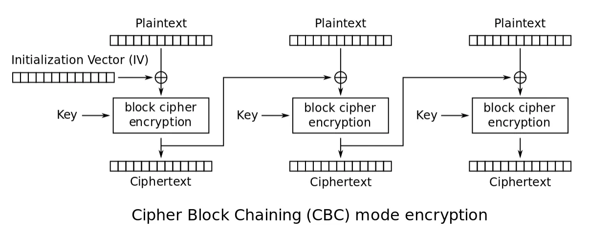
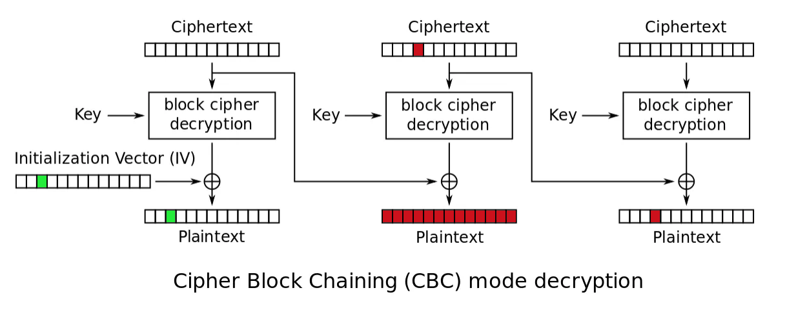

# Advanced Encryption Standard (AES)

AES is a symmetric key, block cipher algorithm. It is used in many common Internet protocols and operating system services, including TLS, IPSec, and file-level or full-disk encryption. Given its ubiquity, it is an important cipher to know how to use, and the principles of (in)correct use of AES transfer easily to (in)correct use of other ciphers.

Even though AES is a block cipher, it (like many other block ciphers) can be used in a way that makes it behave like a stream cipher.

AES processes blocks of 128 bits using a secret key of 128, 192, or 256 bits, with the 128-bit key being the most common because it makes encryption slightly faster and because the difference between 128- and 256-bit security is meaningless for most applications.

## Methods

There are methods that can be used to alter the way a symmetric cipher works. Some of these are meant to increase the security of the cipher. Others to change a block cipher into a stream cipher.

* The simplest of the block cipher encryption modes is electronic codebook (ECB), which is barely a mode of operation at all.
* Cipher block chaining (CBC) is like ECB but with a small twist that makes a big difference: instead of encrypting the $i$th block, $P_i$ , as $C_i = E(K, P_i)$, CBC sets $C_i = E(K, P_i ⊕ C_i − 1)$, where $C_i − 1$ is the previous ciphertext block, thereby chaining the blocks $C_i − 1$ and $C_i$. When encrypting the first block, $P_1$, there is no previous ciphertext block to use, so CBC takes a random initial value ($IV$).
* To avoid the troubles and retain the benefits of ciphertext stealing, you can use counter mode (CTR). CTR is hardly a block cipher mode: it turns a block cipher into a stream cipher that just takes bits in and spits bits out and doesn’t embarrass itself with the notion of blocks.

## ECB

The most basic encryption mode is the electronic codebook (ECB) mode. The message is divided into blocks and each block is encrypted separately. The problem is that if you submit the same plain text more than once, you always get the same ciphertext. This gives attackers a place to begin analysing the cipher to attempt to derive the key. ECB is using the cipher exactly as it is described without improving its security.

There is no good reason to use ECB over CBC, if both ends of the communication can support CBC. Cipher block chaining is a strong deterrent to known plain text attacks.

## CBC

When using cipher block chaining (CBC) mode, each block of plaintext is XOR’d with the previous ciphertext block before being encrypted. This means there is more randomness in the final ciphertext. This is much more secure than electronic codebook mode and is the most common mode.

The only issue with CBC is the first block. There is no preceding block of ciphertext to XOR the first plaintext block with. It is common to add an initialization vector (IV) to the first block so that it has something to be XOR'd with. The initialization vector is a pseudorandom number, much like the cipher key. Usually, an IV is only used once, a $nonce$ (Number Only used Once). 

The decryption process in CBC mode is done as:

\begin{align} P_1 =& Dec_k(C_1) \oplus IV\\ P_i =& Dec_k(C_i) \oplus C_{i-1},\;\; 1 < i \leq nb, \end{align} 

where $nb$ is the number of blocks.

## Bit-flipping attack

If you know the position of the target byte, then you can modify the corresponding ciphertext position in the previous ciphertext block. For example, if you modify a byte in the ciphertext $C_{i-1}$, then $P_i$ will be changed by one block since $C_{i-1}$ only affects the plaintext $P_i$ by $\oplus$. 

A ciphertext byte of $C_2$ is modified: This affects the corresponding byte in the next plaintext block $P_3$ and in the corresponding full plaintext block $P_2$ which has the same index as the modified ciphertext which is garbage. There is an error.

An $\text{IV}$ byte is modified: This affects only the corresponding byte in the first plaintext $P_1$. If the target plaintext is in the first block, this will not leave a trace.

## Padding oracle attack

## CTR

In CTR mode, encryption XORs the plaintext and the stream taken from “encrypting” the nonce, `N`, and counter, `Ctr`. Decryption is the same, so you only need the encryption algorithm for both
encryption and decryption.

## PMAC forgery attack

## RootMe challenges

* [AES Electronic code book](../symmetric/ecb.md)
* [AES 4 rounds](../symmetric/4-rounds.md)
* [CBC Bit-flipping attack](../symmetric/cbc-bit-flipping.md)
* [AES128 Counter mode attack](../symmetric/ctr.md)
* [AES Fault attack #1](../symmetric/fault1.md)
* [CBC padding attack](../symmetric/cbc-padding.md)
* [Side channel AES: CPA](../symmetric/cpa.md)
* [Side Channel AES: first round](../symmetric/sc-first-round.md)
* [AES Weaker variant](../symmetric/weaker-variant.md)
* [AES Fault attack #2](../symmetric/fault2.md)
* [AES PMAC forgery attack](../symmetric/pmac.md)

## Resources

* [FIPS 197 - Advanced Encryption Standard (AES)](https://repository.root-me.org/Cryptographie/Sym%C3%A9trique/EN%20-%20FIPS%20197%20-%20Advanced%20Encryption%20Standard%20(AES).pdf)
* [The Block Cipher SQUARE - Daemen, Knudsen, Rijmen](https://repository.root-me.org/Cryptographie/Sym%C3%A9trique/EN%20-%20The%20Block%20Cipher%20SQUARE%20-%20Daemen,%20Knudsen,%20Rijmen.pdf)
* [SANS Institute AES CBC Bit Flipping](https://www.root-me.org/en/Challenges/Cryptanalysis/AES-CBC-Bit-Flipping-Attack)
* [Padding oracle attacks on the ISO CBC mode encryption standard](https://repository.root-me.org/Cryptographie/EN%20-%20Padding%20oracle%20attacks%20on%20the%20ISO%20CBC%20mode%20encryption%20standard.pdf)
* [Security flaws induced by CBC padding](https://repository.root-me.org/Cryptographie/EN%20-%20Security%20flaws%20induced%20by%20CBC%20padding.pdf)
* [Efficient padding oracle attacks on cryptographic systems](https://repository.root-me.org/Cryptographie/EN%20-%20Efficient%20padding%20oracle%20attacks%20on%20cryptographic%20systems.pdf)
* [Practical Padding oracle attacks](https://repository.root-me.org/Cryptographie/EN%20-%20Practical%20Padding%20oracle%20attacks.pdf)  

