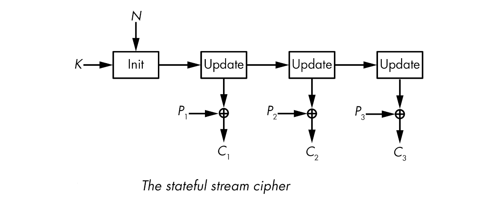
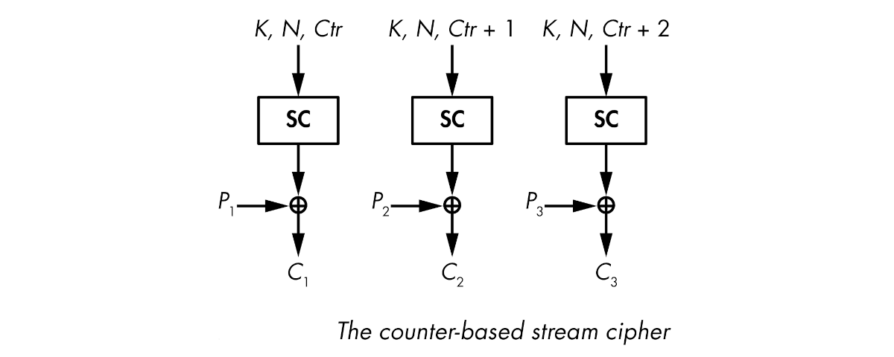

# Stream ciphers

Stream ciphers are deterministic. This allows for decrypting by regenerating the pseudorandom bits used to encrypt. Stream ciphers take two values: a key and a nonce. The key should be secret and is usually 128 or 256 bits. The nonce does not have to be secret, but should be unique for each key and is usually between 64 and 128 bits. The nonce is sometimes called the IV, for initial value.

Stateful stream ciphers have a secret internal state that evolves throughout keystream generation. The cipher initialises the state from the key and the nonce and then calls an update function to update the state value and produce one or more keystream bits from the state.

Counter-based stream ciphers produce chunks of keystream from a key, a nonce, and a counter value. No secret state is memorised during keystream generation.

## Linear Feedback Shift Registers

Linear feedback shift registers (LFSRs) are FSRs with a linear feedback function, a function that is the XOR of some bits of the state. Thanks to this linearity, LFSRs can be analyzed using notions like linear complexity, finite fields, and primitive polynomials.

## RootMe challenges

* [LFSR - Known plaintext](../streams/lfsr.md)

## Security

Many things can go wrong with stream ciphers, from brittle, insecure designs to strong algorithms incorrectly implemented.

The most common failure seen with stream ciphers occurs when a nonce is reused more than once with the same key. This produces identical keystreams, allowing an adversary to break the encryption by XORing two ciphertexts together.

## Resources

* [Linear Feedback Shift Registers (LFSR) - Auburn Univ](https://repository.root-me.org/Cryptographie/EN%20-%20LFSR-based%20Stream%20Ciphers%20-%20Anne%20Canteaut.pdf)
* [Tutorial: Linear Feedback Shift Registers (LFSRs) – Part 1](https://www.edn.com/tutorial-linear-feedback-shift-registers-lfsrs-part-1/)
* [Tutorial: Linear Feedback Shift Registers (LFSRs) – Part 2](https://www.edn.com/tutorial-linear-feedback-shift-registers-lfsrs-part-2/)
* [Tutorial: Linear Feedback Shift Registers (LFSRs) – Part 3](https://www.edn.com/tutorial-linear-feedback-shift-registers-lfsrs-part-3/)