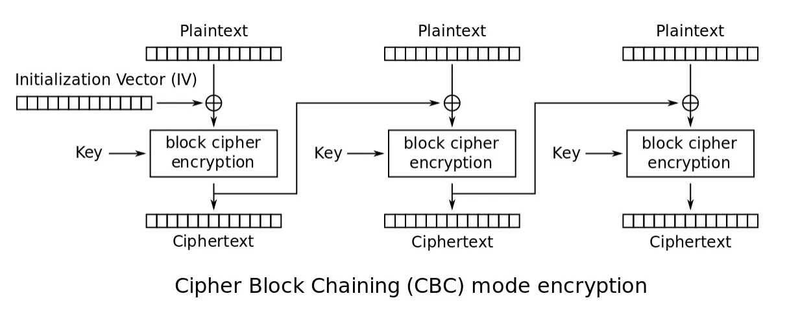
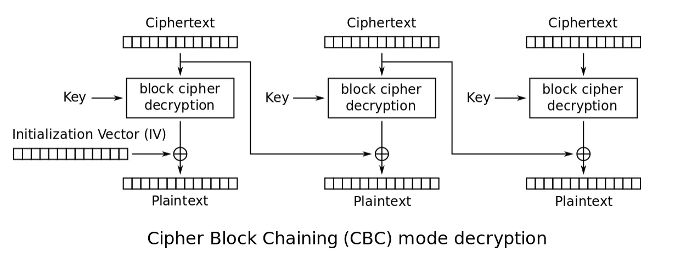
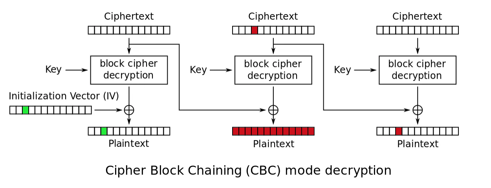

# CBC Bit-flipping attack

[RootMe Challenge: Flip it](https://www.root-me.org/en/Challenges/Cryptanalysis/AES-CBC-Bit-Flipping-Attack): An elite hacker team is sharing tools.
Some tools seem interesting, but you need to join their team to access them.

## Symmetric methods

There are methods that can be used to alter the way a symmetric cipher works. Some of these are meant to increase the security of the cipher. Others to change a block cipher into a stream cipher.

## CBC

When using cipher block chaining (CBC) mode, each block of plaintext is XOR’d with the previous ciphertext block before being encrypted. This means there is more randomness in the final ciphertext. This is much more secure than electronic codebook mode and is the most common mode.

The only issue with CBC is the first block. There is no preceding block of ciphertext to XOR the first plaintext block with. It is common to add an initialization vector (IV) to the first block so that it has something to be XOR'd with. The initialization vector is a pseudorandom number, much like the cipher key. Usually, an IV is only used once, a $nonce$ (Number Only used Once). 

The decryption process in CBC mode is done as:

\begin{align} P_1 =& Dec_k(C_1) \oplus IV\\ P_i =& Dec_k(C_i) \oplus C_{i-1},\;\; 1 < i \leq nb, \end{align} 

where $nb$ is the number of blocks.

## Bit flipping

If you know the position of the target byte, then you can modify the corresponding ciphertext position in the previous ciphertext block. For example, if you modify a byte in the ciphertext $C_{i-1}$, then $P_i$ will be changed by one block since $C_{i-1}$ only affects the plaintext $P_i$ by $\oplus$. 

A ciphertext byte of $C_2$ is modified: This affects the corresponding byte in the next plaintext block $P_3$ and in the corresponding full plaintext block $P_2$ which has the same index as the modified ciphertext which is garbage. There is an error.

An $\text{IV}$ byte is modified: This affects only the corresponding byte in the first plaintext $P_1$. If the target plaintext is in the first block, this will not leave a trace.

## Resources

* [SANS Institute AES CBC Bit Flipping](https://www.root-me.org/en/Challenges/Cryptanalysis/AES-CBC-Bit-Flipping-Attack)
