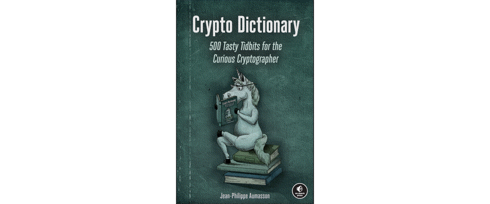

Beyond the visible
==============================================

Many people assume that when information is not being transmitted, it is safe. But to effectively encrypt personally
identifiable information, many variables must be considered, including the state the data is in:
at rest, in transit, or in use.

While data in transit is easier to hack, data at rest is more valuable than data in transit because it often has a
higher level of sensitive information. And just because data is at rest does not mean it is not moving. Many data
breaches happen due to a lost USB drive or laptop.

----

.. toctree::
   :glob:
   :maxdepth: 1
   :includehidden:
   :caption: Notes on techniques

   docs/attacks/README.md
   docs/attacks/brute-force.md
   docs/attacks/ciphertext-only.md
   docs/attacks/plaintext.md
   docs/attacks/ciphertext.md
   docs/attacks/known-plaintext.md
   docs/attacks/algorithm.md
   docs/attacks/side-channel.md
   docs/attacks/physical.md

.. toctree::
   :glob:
   :maxdepth: 1
   :includehidden:
   :caption: E2EE messaging

   docs/e2ee/README.md
   docs/e2ee/unknown-key.md
   docs/e2ee/forgery.md
   docs/e2ee/group-impersonation.md

.. toctree::
   :glob:
   :maxdepth: 1
   :includehidden:
   :caption: Email

   docs/email/README.md
   docs/email/decrypt.md
   docs/email/other.md
   docs/email/recipient.md
   docs/email/private.md

.. toctree::
   :glob:
   :maxdepth: 1
   :includehidden:
   :caption: Shift left

   docs/prevent/README.md
   docs/prevent/transit.md
   docs/prevent/rest.md
   docs/prevent/use.md

----

.. image:: _static/images/ctf.png
  :alt: CTFs and challenges

.. toctree::
   :maxdepth: 1
   :includehidden:
   :caption: Cryptanalysis

   docs/analysis/README.md
   docs/analysis/dcc.md
   docs/analysis/dcc2.md
   docs/analysis/lm.md
   docs/analysis/md5.md
   docs/analysis/nt.md
   docs/analysis/sha2.md
   docs/analysis/caesar.md
   docs/analysis/cisco.md
   docs/analysis/pixels.md

----

