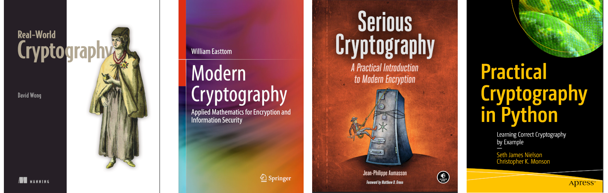

Beyond the visible
==============================================

Come backstage to discover what is usually not seen concerning encoded and encrypted data in rest, underway, and in use. Witness the strategic decisions, the designing of algorithms, the complex implementations, the innovative (yet old and not really changing) technological solutions, the endless resources invested into research and development of security and privacy ... and everything that isn't, and everything that is, but gets hacked.

.. image:: _static/images/in-progress.png
  :alt: In progress ...

----

.. toctree::
   :glob:
   :maxdepth: 1
   :includehidden:
   :caption: Notes on techniques

   docs/notes/README.md
   docs/notes/brute-force.md
   docs/notes/ciphertext-only.md
   docs/notes/plaintext.md
   docs/notes/ciphertext.md
   docs/notes/known-plaintext.md
   docs/notes/algorithm.md
   docs/notes/side-channel.md
   docs/notes/physical.md

----

.. toctree::
   :maxdepth: 1
   :includehidden:
   :caption: Ciphers

   docs/ciphers/README.md
   docs/ciphers/caesar.md
   docs/ciphers/vigenere.md
   docs/ciphers/rail-fence.md
   docs/ciphers/polybe.md
   docs/ciphers/enigma.md
   docs/ciphers/otp.md

.. toctree::
   :maxdepth: 1
   :includehidden:
   :caption: Hashing

   docs/hashes/README.md
   docs/hashes/dcc.md
   docs/hashes/dcc2.md
   docs/hashes/lm.md
   docs/hashes/md5.md
   docs/hashes/nt.md
   docs/hashes/sha2.md
   docs/hashes/cisco.md
   docs/hashes/sha3.md

.. toctree::
   :glob:
   :maxdepth: 1
   :includehidden:
   :caption: Symmetric encryption

   docs/symmetric/README.md
   docs/symmetric/ecb.md
   docs/symmetric/cbc-bit-flipping.md
   docs/symmetric/4-rounds.md
   docs/symmetric/ctr.md
   docs/symmetric/fault1.md
   docs/symmetric/cbc-padding.md
   docs/symmetric/cpa.md
   docs/symmetric/sc-first-round.md
   docs/symmetric/weaker-variant.md
   docs/symmetric/fault2.md
   docs/symmetric/pmac.md

.. toctree::
   :glob:
   :maxdepth: 1
   :includehidden:
   :caption: Asymmetric encryption

   docs/asymmetric/README.md
   docs/asymmetric/factorisation.md
   docs/asymmetric/oracle.md
   docs/asymmetric/corrupted-key1.md
   docs/asymmetric/fractions.md
   docs/asymmetric/modulus.md
   docs/asymmetric/padding.md
   docs/asymmetric/signature.md
   docs/asymmetric/corrupted-key2.md
   docs/asymmetric/corrupted-key3.md
   docs/asymmetric/multiple-recipients.md
   docs/asymmetric/lee-cooper.md

.. toctree::
   :maxdepth: 1
   :includehidden:
   :caption: Data

   docs/data/README.md
   docs/data/elf64-pid.md
   docs/data/pkzip.md
   docs/data/bmp-xor.md
   docs/data/insecure-storage1.md
   docs/data/android-lock.md

.. toctree::
   :glob:
   :maxdepth: 1
   :includehidden:
   :caption: Key Exchange

   docs/exchange/README.md
   docs/exchange/ecdhe.md

.. toctree::
   :glob:
   :maxdepth: 1
   :includehidden:
   :caption: Signatures

   docs/signatures/README.md
   docs/signatures/ecdsa-conventional.md
   docs/signatures/ecdsa-error.md

----

